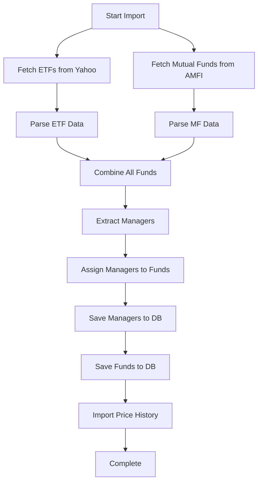

# Fund Data Ingestion System 🚀

A comprehensive system for importing real-world mutual fund and ETF data from multiple sources into your MongoDB database.

## 📋 Overview

This ingestion system automatically fetches and imports:

- **150+ funds** (100+ ETFs, 50+ mutual funds)
- **Fund manager details** with experience and bio
- **Daily NAV updates** with price history
- **Historical price data** for technical analysis

## 🎯 Data Sources

### 1. Yahoo Finance

- **ETFs**: 50+ global and Indian ETFs
- **Coverage**: US market ETFs (SPY, QQQ, GLD, etc.) + Indian ETFs (NIFTYBEES.NS, GOLDBEES.NS, etc.)
- **Data**: Real-time prices, historical data, volume, OHLC

### 2. AMFI (Association of Mutual Funds in India)

- **Mutual Funds**: 100+ top Indian mutual funds
- **Coverage**: Equity, Debt, Hybrid, Index funds from top 15 fund houses
- **Data**: Daily NAV, scheme details, fund house information

### 3. Fund Managers Database

- **Profiles**: 15+ prominent Indian fund managers
- **Details**: Experience, qualifications, bio, funds managed
- **Fund Houses**: HDFC, ICICI, SBI, Axis, Kotak, etc.

## 🏗️ Architecture

```
┌─────────────────────────────────────────────────────┐
│          Fund Ingestion Orchestrator                │
└────────────────┬────────────────────────────────────┘
                 │
       ┌─────────┴──────────┐
       │                    │
   ┌───▼────┐          ┌────▼────┐
   │ Yahoo  │          │  AMFI   │
   │Finance │          │ Importer│
   └───┬────┘          └────┬────┘
       │                    │
       └─────────┬──────────┘
                 │
         ┌───────▼────────┐
         │  Fund Manager  │
         │    Extractor   │
         └───────┬────────┘
                 │
         ┌───────▼────────┐
         │   MongoDB      │
         │  • funds       │
         │  • fundPrices  │
         │  • fundManagers│
         └────────────────┘
```

## 📦 Components

### 1. **Yahoo Finance Importer** (`yahoo-finance.importer.ts`)

```typescript
import { yahooFinanceImporter } from './services/importers';

// Import 50 ETFs
const result = await yahooFinanceImporter.importETFs({ limit: 50 });

// Get historical prices
const history = await yahooFinanceImporter.importHistoricalPrices('SPY', '1y');
```

**Features:**

- ✅ 20+ Indian ETFs (Nifty, Bank, Gold, Silver)
- ✅ 30+ US ETFs (Sector, Bond, Commodity, Thematic)
- ✅ Real-time quote data
- ✅ Historical OHLC data
- ✅ Rate limiting (500ms between requests)

### 2. **AMFI Importer** (`amfi.importer.ts`)

```typescript
import { amfiImporter } from './services/importers';

// Import 100 mutual funds
const result = await amfiImporter.importMutualFunds({ limit: 100 });
```

**Features:**

- ✅ Parses AMFI NAVAll.txt file
- ✅ 15+ top fund houses prioritized
- ✅ Diverse category selection
- ✅ Automatic categorization (Equity, Debt, Hybrid)

### 3. **Fund Manager Importer** (`fund-manager.importer.ts`)

```typescript
import { fundManagerImporter } from './services/importers';

// Extract managers from funds
const managers = await fundManagerImporter.extractManagers(funds);

// Get known managers
const knownManagers = fundManagerImporter.getAllKnownManagers();
```

**Features:**

- ✅ 15 pre-populated manager profiles
- ✅ Auto-extraction from fund data
- ✅ Manager-to-fund mapping
- ✅ Experience and qualification tracking

### 4. **Orchestrator** (`orchestrator.ts`)

```typescript
import { fundIngestionOrchestrator } from './services/importers';

// Import everything
await fundIngestionOrchestrator.importAllFunds({
  etfLimit: 50,
  mutualFundLimit: 100,
});

// Update NAVs
await fundIngestionOrchestrator.updateLatestNAVs();

// Import historical prices
await fundIngestionOrchestrator.importHistoricalPrices(['SPY', 'QQQ'], '1y');
```

## 🚀 Usage

### Initial Import (Run Once)

```bash
# Import all funds (ETFs + Mutual Funds + Managers)
npm run import:all

# Or with custom limits
npm run import:funds -- --etfs=30 --mutual-funds=70
```

This will:

1. ✅ Import 50 ETFs from Yahoo Finance
2. ✅ Import 100 mutual funds from AMFI
3. ✅ Extract and save fund managers
4. ✅ Assign managers to funds
5. ✅ Save everything to MongoDB

**Expected output:**

```
════════════════════════════════════════════════════
   🚀 FUND INGESTION SYSTEM - STARTING IMPORT
════════════════════════════════════════════════════

📊 STEP 1: Importing ETFs from Yahoo Finance
─────────────────────────────────────────────────
  Fetching NIFTYBEES.NS...
  ✓ Nippon India ETF Nifty BeES
  ...

✅ ETF Import Results:
   • Imported: 50
   • Failed: 0

📈 STEP 2: Importing Mutual Funds from AMFI
─────────────────────────────────────────────────
  ✓ HDFC Top 100 Fund - Direct Plan - Growth
  ...

✅ Mutual Fund Import Results:
   • Imported: 100
   • Failed: 0

👥 STEP 3: Extracting Fund Managers
─────────────────────────────────────────────────
✓ Extracted 45 unique fund managers

💾 STEP 5: Saving to Database
─────────────────────────────────────────────────
✓ Saved 45 managers
✓ Saved 150 funds

════════════════════════════════════════════════════
   ✅ IMPORT COMPLETED SUCCESSFULLY
════════════════════════════════════════════════════
   📊 Total Funds: 150
   📈 ETFs: 50
   📉 Mutual Funds: 100
   👥 Managers: 45
════════════════════════════════════════════════════
```

### Import Historical Prices

```bash
# Import 1-year history for specific funds
npm run import:prices -- SPY QQQ NIFTYBEES.NS GOLDBEES.NS
```

### Daily NAV Updates

```bash
# Update latest NAVs for all funds
npm run import:update-navs
```

## ⏰ Automated Scheduling

The system includes a scheduler for automatic updates:

```typescript
import { navUpdateScheduler } from './services/schedulers/nav-update.scheduler';

// Start scheduler
navUpdateScheduler.start();
```

**Scheduled Jobs:**

1. **Daily NAV Update** - 6:00 PM IST (Mon-Fri, after market close)
2. **Weekly Price History** - 2:00 AM Sunday
3. **Daily Statistics** - 7:00 PM IST (52-week high/low, volatility)

Add to your `src/index.ts`:

```typescript
import { navUpdateScheduler } from './services/schedulers/nav-update.scheduler';

// Start server
app.listen(PORT, () => {
  console.log(`Server running on port ${PORT}`);

  // Start NAV update scheduler
  navUpdateScheduler.start();
});
```

## 📊 Sample Data

### Funds Imported

**Indian ETFs:**

- NIFTYBEES.NS - Nippon India ETF Nifty BeES
- BANKBEES.NS - Nippon India ETF Bank BeES
- GOLDBEES.NS - Nippon India ETF Gold BeES
- SILVERBEES.NS - Nippon India Silver ETF

**US ETFs:**

- SPY - SPDR S&P 500
- QQQ - Invesco QQQ (Nasdaq-100)
- GLD - SPDR Gold Shares
- ARKK - ARK Innovation ETF

**Indian Mutual Funds:**

- HDFC Top 100 Fund
- ICICI Prudential Bluechip Fund
- SBI Large Cap Fund
- Axis Mid Cap Fund

### Fund Managers

- **Prashant Jain** - HDFC Mutual Fund (30 years experience)
- **S. Naren** - ICICI Prudential (28 years experience)
- **Rajeev Thakkar** - PPFAS Mutual Fund (25 years experience)
- **Neelesh Surana** - Mirae Asset (22 years experience)

## 🔧 Configuration

### Rate Limiting

Yahoo Finance: 500ms delay between requests

```typescript
// In yahoo-finance.importer.ts
await this.delay(500); // Adjust as needed
```

### Import Limits

Modify limits in orchestrator calls:

```typescript
await fundIngestionOrchestrator.importAllFunds({
  etfLimit: 100, // Default: 50
  mutualFundLimit: 200, // Default: 100
  skipExisting: true,
});
```

### Data Sources

Add more ETF symbols in `yahoo-finance.importer.ts`:

```typescript
private indianETFs = [
  'NIFTYBEES.NS',
  'YOUR_SYMBOL.NS',
  // Add more...
];
```

## 📈 Data Flow



## 🧪 Testing

Test individual importers:

```typescript
import { yahooFinanceImporter } from './services/importers';

// Test Yahoo Finance
const quote = await yahooFinanceImporter.getQuote('SPY');
console.log(quote);

// Test AMFI
import { amfiImporter } from './services/importers';
const navData = await amfiImporter.fetchNAVData();
console.log(navData.substring(0, 200));
```

## ⚠️ Important Notes

1. **First Run**: Initial import takes ~5-10 minutes depending on network
2. **Rate Limits**: Yahoo Finance has rate limits; respect delays
3. **AMFI Data**: Updated daily at ~8 PM IST
4. **Database**: Ensure MongoDB is running before import
5. **Historical Data**: Import separately for better performance

## 🎯 Next Steps

After successful import:

1. ✅ Verify data in MongoDB:

```javascript
db.funds.countDocuments(); // Should be ~150
db.fundManagers.countDocuments(); // Should be ~45
db.fundPrices.countDocuments(); // Varies based on history import
```

2. ✅ Test API endpoints:

```bash
curl http://localhost:3001/api/funds
curl http://localhost:3001/api/funds/SPY
curl http://localhost:3001/api/fund-managers
```

3. ✅ Enable scheduler for daily updates

4. ✅ Monitor logs for any import failures

## 🐛 Troubleshooting

**Issue: Import fails with network error**

- Check internet connection
- Verify Yahoo Finance and AMFI URLs are accessible
- Increase timeout values

**Issue: No data imported**

- Check MongoDB connection
- Verify database permissions
- Check logs for specific errors

**Issue: Duplicate funds**

- Set `skipExisting: true` in options
- Check fundId uniqueness

**Issue: Manager not assigned to funds**

- Run manager assignment separately
- Check fund house name matching

## 📝 License

MIT

## 🤝 Contributing

Feel free to add more data sources, improve parsers, or add more fund managers!
